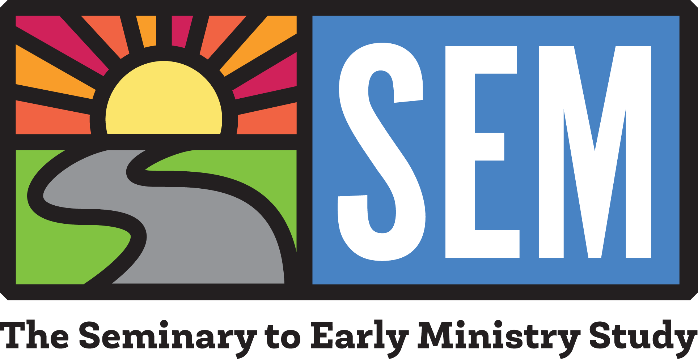

[Download this as a pdf](images/PostDocDescription_Feb_2021.pdf)

**Job Posting: Postdoctoral Associate, Seminary to Early Ministry Project**

**General Information**

The Seminary to Early Ministry Study, a joint initiative between Duke Divinity School and the Duke Global Health Institute, invites applications for a Postdoctoral Associate. The initial appointment will be made for one year beginning on July 1, 2021, with an additional year available upon satisfactory performance. 

The Seminary to Early Ministry Study is the first major longitudinal study examining divinity school education. Our aim is ambitious: To paint the most comprehensive picture of how divinity school students are formed throughout their training and into the early stages of their careers. Through this, we hope to spark informed conversations about divinity school education and to shape the future of ministry. The Seminary to Early Ministry Study is part of the larger Duke Clergy Health Initiative and is funded by a grant from The Duke Endowment. More information on the SEM Study and the Clergy Health Initiative can be found here: [semstudy.org](https://www.semstudy.org); [divinity.duke.edu/initiatives/clergy-health-initiative](https://divinity.duke.edu/initiatives/clergy-health-initiative).

**Responsibilities**

The successful candidate will support all research aspects of the SEM Study, with a special focus on the quantitative aspects of the study. The successful candidate will also conduct analyses for other clergy health projects as needed. Duties includes, but are not limited to, quantitative analysis, writing manuscripts for peer-review, supervising undergraduate students, and advancing the intellectual rigor of the study. This position will be supervised by David Eagle, Assistant Research Professor of Global Health. The successful candidate will be part of the Clergy Health Initiative, which provides a supportive team environment.

**Qualifications**

Candidates must hold (or plan to defend by August 2021) a PhD in sociology, psychology or a related discipline and have expertise in quantitative methods. Familiarity with R, or a willingness to quickly get up to speed in R, is required. Candidates must have research interests in religion, education, health and/or social networks. Interest in and experience working with clergy, congregations, and/or theological education is a plus. Familiarity with the United Methodist Church is considered an asset. Authorship on peer reviewed manuscripts is considered a major asset. 

In terms of analyses, applications should be familiar with all aspects of standard regression analyses using generalized linear models. Experience with longitudinal analysis is also desired, including hierarchical linear models and structural equation modeling approaches. Experience with social network analysis is preferred. The candidate must have strong data cleaning and data management skills.

**Other policies**

This position has a small travel/professional development allowance and is encouraged to present their research at SSSR and other professional meetings. We encourage the successful applicant to take advantage of the many opportunities for training available at Duke, UNC, SAMSI, etc. The successful applicant is expected to move to the Research Triangle (Raleigh-Durham-Chapel Hill area). Office space will be provided at the Duke Global Health Institute. 

**To Apply**

Please send a cover letter outlining your qualifications for this position, a current CV, a research statement, an academic writing sample, and a list of three references to [joshua.gaghan@duke.edu](mailto:joshua.gaghan@duke.edu). You may address your materials to David Eagle, Assistant Research Professor in Global Health, Duke Global Health Institute, 310 Trent Drive, Durham, NC 27708. You may contact David for more information at [david.eagle@duke.edu](mailto:david.eagle@duke.edu).  Salary is commensurate with experience. This position is full time and eligible for Duke benefits. Application review will begin on March 15th, 2021 and will be reviewed on an ongoing basis until a suitable candidate is found.

